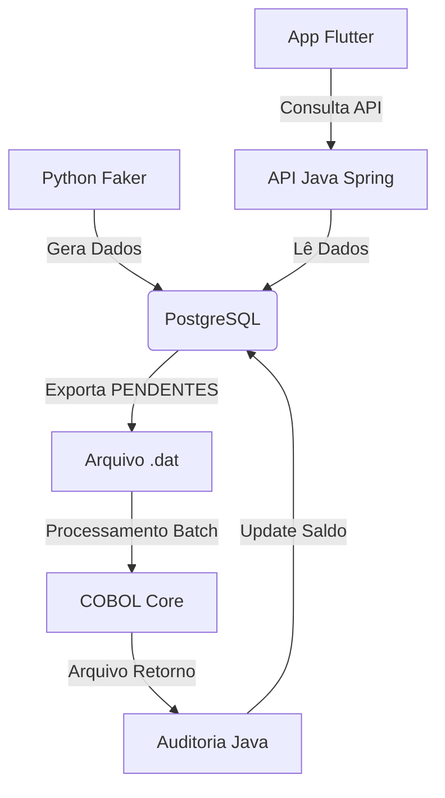

# TechBank Hybrid System 🚀

Este projeto simula o ecossistema de uma Fintech moderna integrada a um sistema bancário legado.

## 🛠 Stack Tecnológica

- **Banco de Dados:** PostgreSQL (Relacional)
- **Data Engine:** Python (Faker, Psycopg2)
- **Core Bancário:** COBOL (Processamento Batch)
- **API:** Java Spring Boot (Em breve)
- **Frontend:** Flutter (Em breve)

## ⚙️ Como funciona?

1. O Python gera dados fictícios no Postgres.
2. O Python exporta transações PENDENTES para um arquivo flat (.dat).
3. O COBOL processa as taxas e gera um arquivo de retorno.
4. (Próximo passo) O Java expõe os resultados para o cliente final.
5. (Próximo passo) O Flutter oferece uma interface amigável para o usuário.
6. O Java realiza auditoria de integridade dos dados processados.
7. O saldo atualizado é refletido no banco de dados PostgreSQL.
8. O cliente consulta seu saldo via API.
9. O Flutter exibe o saldo atualizado ao usuário.

## 📊 Diagrama de Fluxo do Sistema

## 🤖 Desenvolvimento Guiado por IA (AI-Assisted Engineering)

Este projeto foi desenvolvido utilizando uma metodologia de parceria com Inteligência Artificial (Gemini), atuando em diferentes papéis no ciclo de vida do software:

- **Arquitetura de Sistemas:** Definição da comunicação entre o legado (COBOL) e o moderno (Python/PostgreSQL).
- **Simulação de Ambiente Real:** A IA atua como **Senior Tech Lead**, gerando tickets de tarefas e desafios de implementação.
- **Chaos Engineering (Próxima Fase):** A IA atuará como "Chefe do Caos", injetando dados sujos, inconsistências de transação e falhas simuladas para testar a resiliência das validações em Java e Python.
- **Code Review:** Validação de boas práticas de segurança e performance em SQL e COBOL.

### 🛡️ Estratégias de Resiliência e Segurança

- **Checksum Audit:** Implementação de uma camada de auditoria em Java para validar a integridade dos dados processados pelo COBOL.
- **Chaos Engineering:** Simulação de corrupção de arquivos flat para testar os mecanismos de rollback do sistema.
- **Double-Entry Bookkeeping:** Garantia de que nenhuma transação seja perdida entre as transações de arquivos e o banco de dados SQL.

## 📂 Estrutura do Projeto

- `data-engine/`: Código Python para geração e exportação de dados.
- `core-bancario/`: Código COBOL para processamento batch.
- `api/`: (Em breve) Código Java Spring Boot para exposição da API.
- `frontend/`: (Em breve) Código Flutter para a interface do usuário.
- `scripts/`: Scripts auxiliares para configuração e execução do ambiente.
- `docs/`: (Em breve)Documentação adicional e diagramas do sistema.
- `tests/`: (Em breve)Testes automatizados para validação do sistema.
- `chaos/`: (Em breve) Scripts e ferramentas para Chaos Engineering.
- `audit/`: (Em breve)Código Java para auditoria de integridade dos dados.
- `README.md`: Este arquivo de documentação.

## 🚀 Próximos Passos

- Implementar a API em Java Spring Boot.
- Desenvolver o frontend em Flutter.
- Adicionar testes automatizados para garantir a integridade dos dados.
- Implementar Chaos Engineering para validar a resiliência do sistema.
- Otimizar performance e segurança do banco de dados.
